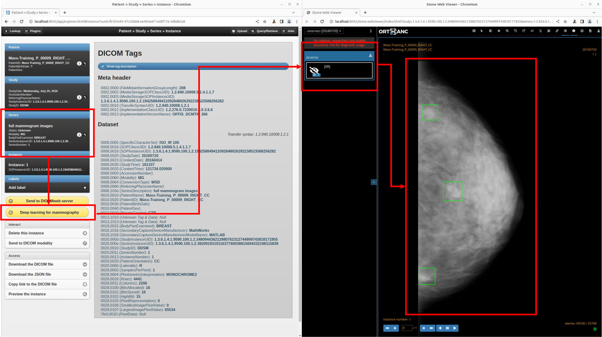

Mammography plugin for Orthanc
==============================

This plugin for [Orthanc](https://orthanc.uclouvain.be/) adds a deep learning algorithm to detect masses in mammograms.
The inference algorithm produces DICOM-SR (structured reports) instances that are stored inside Orthanc.
The DICOM-SR instance can then be displayed using a version of the [Stone Web viewer for Orthanc](https://www.orthanc-server.com/static.php?page=stone-web-viewer).



As of 2024-03-16, a scientific paper associated with this plugin is under review.
Once accepted, this paper will provide technical details about the deep learning algorithm that is shipped within this plugin.

Setup
-----

Before cloning this repositoring to your computer, make sure that the [Git extension for versioning large files](https://git-lfs.com/) is installed.
Under Debian/Ubuntu distributions, this can be done by running:

```
$ sudo apt update
$ sudo apt install git-lfs
```

Also, make sure that Python 3 is installed with support of [virtual environments](https://docs.python.org/3/library/venv.html):

```
$ sudo apt update
$ sudo apt install python3 python3-venv
```

Finally, you evidently have to [install Orthanc](https://www.orthanc-server.com/download.php).
The mammography plugin requires the following two plugins for Orthanc to be installed:

* [Python plugin](https://orthanc.uclouvain.be/book/plugins/python.html).
* [DICOMweb plugin](https://orthanc.uclouvain.be/book/plugins/dicomweb.html), if you want to use the DICOM-SR viewer.

Configuration
-------------

Firstly, clone this repository:

```
$ cd /tmp/
$ git clone https://github.com/jodogne/orthanc-mammography/
```

Secondly, setup the Python virtual environment with the required dependencies:

```
$ cd /tmp/orthanc-mammography/
$ python3 -m venv venv
$ source ./venv/bin/activate
(venv) python3 -m pip install --upgrade pip
(venv) python3 -m pip install -r requirements.txt
```

Thirdly, create a [configuration file](https://orthanc.uclouvain.be/book/plugins/dicomweb.html#installation) for Orthanc with Python.
A minimalist configuration file would look like (make sure to adapt the path to the virtual environment,
depending on your version of Python):

```json
{
  "Plugins" : [
    "...list of paths to the Python and DICOMweb plugins..."
  ],
  "Python" : {
    "Path" : "./mammography.py"
  },
  "Mammography" : {
    "VirtualEnv" : "./venv/lib/python3.10/site-packages/"
  }
}
```

Finally, start Orthanc using this configuration file.

Usage
-----

Two samples images from the [CBIS-DDSM dataset](https://wiki.cancerimagingarchive.net/pages/viewpage.action?pageId=22516629)
are available in the [`./sample-images/` folder](./sample-images/).
[Upload them to Orthanc](https://orthanc.uclouvain.be/book/users/cookbook.html#uploading-dicom-files).

Using the built-in [Orthanc Explorer](http://localhost:8042/app/explorer.html) interface of Orthanc,
go down in the DICOM hierarchy until you reach a DICOM instance whose modality is `MG` (mammogram).
The yellow button `Deep learning for mammography` will appear.

Clicking on the button will launch the deep learning inference. Once the inference is done (this
takes about 5 seconds on a standard laptop), Orthanc Explorer is automatically redirected to
the newly-created DICOM series that contains the DICOM-SR instance with the results of the inference.

You can then click on the yellow button `Stone Web viewer (for mammography)` to display the
content of the DICOM-SR.
